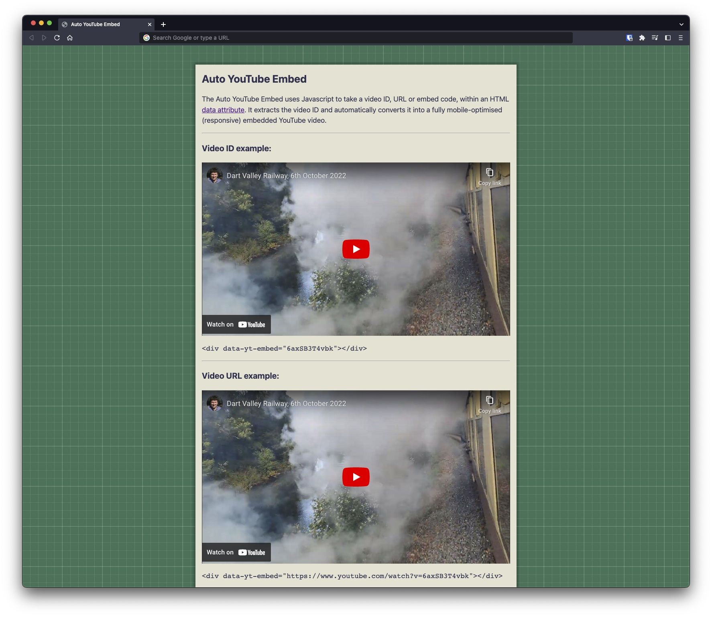

# Auto YouTube Embed

## Introduction

The Auto YouTube Embed uses Javascript to take a video ID, URL or embed code, from an HTML [data&nbsp;attribute](https://developer.mozilla.org/en-US/docs/Learn/HTML/Howto/Use_data_attributes). It extracts the video ID and automatically converts it into a mobile-optimised (responsive) embedded YouTube video.

I originally coded this for use with [WebYep CMS](https://github.com/maxfancourt/WebYep). It enabled a client to login to a website and update video content hosted by YouTube. This client could paste any YouTube video link or ID into the content editor. When the client saved their changes and logged-out, the video would automatically render responsively. This method removed the problems of needing complicated embed code or a client having to remember what link format to use each time.



## Demo

Download the repository and open **test/index.html** in your web browser. When opened, you'll see something like the above screen grab. There are several examples of video IDs, URLs and embed code to experiment with.

## How it works

The Javascript takes a `data-yt-embed` value from a DOM element (like a `<div>`). Something as simple as this will work, at the point where you want the video shown on the webpage:

`<div data-yt-embed="6axSB3T4vbk"></div>`

You see the `6axSB3T4vbk` above? That is the ID of a YouTube video I [uploaded here](https://www.youtube.com/watch?v=6axSB3T4vbk). Replace that ID with a different ID or video URL. The video you want to embed can be supplied in any one of these different formats, thereby making things more user friendly for yourself or clients:

- A link copied directly from the web browser address bar:

```
https://www.youtube.com/watch?v=6axSB3T4vbk
```

- As above, but with other query parameters added:

```
https://www.youtube.com/watch?v=6axSB3T4vbk&list=WL&index=7&t=804s&rel=false
```

- A Shorts video link copied from the web browser address bar:

```
https://www.youtube.com/shorts/6axSB3T4vbk
```

- Shortened video link, generated from the 'share' popup box in YouTube:

```
https://youtu.be/6axSB3T4vbk
```

- A video ID:

```
6axSB3T4vbk
```

- The full embed code YouTube provides:

```
<iframe width="560" height="315" src="https://www.youtube.com/embed/6axSB3T4vbk" title="YouTube test video player" frameborder="0" allow="accelerometer; autoplay; clipboard-write; encrypted-media; gyroscope; picture-in-picture" allowfullscreen></iframe>
```

Let's say a client didn't know what a video ID was but could see and copy the video URL from thier web browser address bar. So the following would still work:

`<div data-yt-embed="https://www.youtube.com/watch?v=6axSB3T4vbk"></div>`

A REGEX (regular expression) extracts just the video ID and stores it as a variable. Then a template literal is used to dynamically create a new iFrame, containing the video. If you view the page source code, you'll see something like this:

```
<div data-yt-embed="6axSB3T4vbk" class="yt_container">
  <iframe src="https://www.youtube-nocookie.com/embed/6axSB3T4vbk" frameborder="0" allow="accelerometer; autoplay; clipboard-write; encrypted-media; gyroscope; picture-in-picture" allowfullscreen="" loading="lazy">
  </iframe>
</div>
```

CSS is used to make the video iFrame scale responsively. Modern web browsers use the ```aspect-ratio``` property; whereas older browsers fall-back to the ```padding-bottom: 56.25%``` and absolute positioning trick.

Now we can effortlessly convert a variety of different YouTube link formats (or just a regular video ID) into a responsive video embed, that'll work just about anywhere. Even if you are not building a website for clients to login and edit using a CMS, the Auto YouTube Embed remains a convenient utility to use in your website.

## Setup

The CSS and Javascript to make this work are stored in the **src/** directory of this repository.

I'd suggest adding the Javascript code to your existing JS file, via a `<script>` tag with a `defer` attribute. That way, it'll avoid any render-blocking and still be able to see your `data-yt-embed` attributes. Just add the Javascript once. The `forEach()` method ensures it'll work for multiple video embeds on a webpage.

The CSS code is similar. Just add this once into a suitable CSS file. The purpose of the CSS is to scale the iFrame responsively and remove any borders, padding, margins or other embellishments a website theme or web browser may try applying.

Put the HTML `<div>` container with the `data-yt-embed` attribute wherever you want the video rendered. Optionally, you _may_ be able make the `data-yt-embed` value editable with a CMS of your choice.

## Privacy

This embed solution is configured to serve video from youtube-nocookie.com. YouTube claims that it'll only track users or set cookies if they play a video. However in the face of GDPR and other stringent privacy laws, it would probably be sensible to only show the embedded video after a user has explicitly given their consent to load third-party content.

## YouTube Shorts Support

YouTube Shorts are 60 second (or less) video clips shot in portrait orientation. Because Shorts use the same video ID format as normal videos, there's no easy method of identifying them. I would suggest that if a website author is going to add a Short, a class of `yt_short` is added to the DIV container like this:

`<div data-yt-embed="6axSB3T4vbk" class="yt_short"></div>`

Then some CSS will resize the video container correctly to 9/16 format. YouTube applies special 'Shorts' branding and different video controls.
